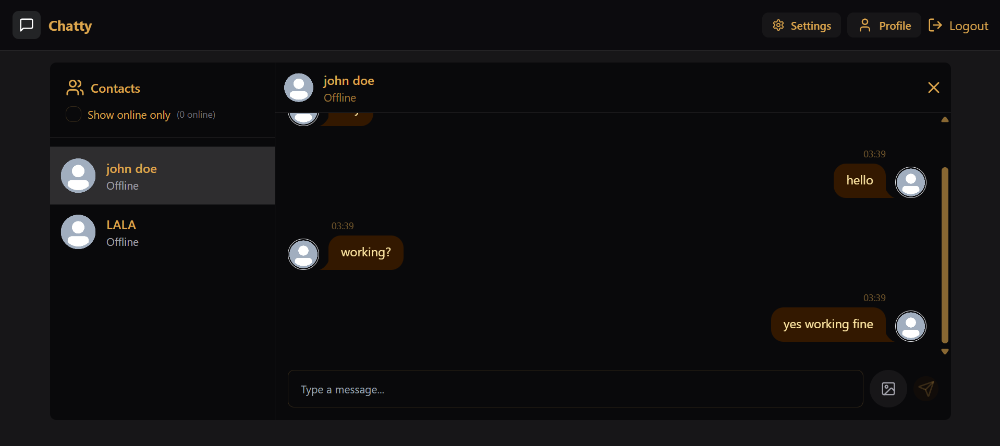

# Full-Stack ChatApp — Submission

**Author:** Khalid Saifullah

---

## 1. Live Application

The application is publicly reachable at:

**[http://16.171.194.52/](http://16.171.194.52/)**

The app is served from an AWS EC2 instance over HTTP on port 80, with Docker Compose managing the frontend, backend, and database containers behind it.

## 2. GitHub Repository

**[https://github.com/ksaifullah2807-cyber/full-stack_chatApp](https://github.com/ksaifullah2807-cyber/full-stack_chatApp)**

This is a standalone repository under my own account (not a linked fork). The commit history reflects the step-by-step build process — from the initial Docker setup, through Docker Compose configuration, to the GitHub Actions deployment workflow.

## 3. Screenshot

*Live chat interface showing real-time messaging between contacts.*

> Place the screenshot image file at `./screenshot.png` in the repo root (same folder as this file) so it renders on GitHub.

## 4. Architecture Summary

**User → Nginx / Frontend → Backend → MongoDB**

- The user reaches the application through the EC2 instance's public IP address.
- Nginx serves the React frontend and routes API and Socket.IO traffic to the backend.
- The Node.js/Express backend handles authentication, chat logic, and real-time events.
- The backend communicates with a MongoDB container kept private inside the Docker network — it is not exposed to the public internet.
- Docker Compose orchestrates all three services (frontend, backend, MongoDB) together on the EC2 host.
- A GitHub Actions workflow SSHes into EC2 to pull and rebuild containers on every push to `main`.
